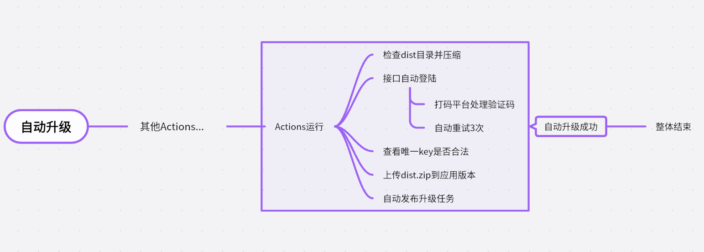
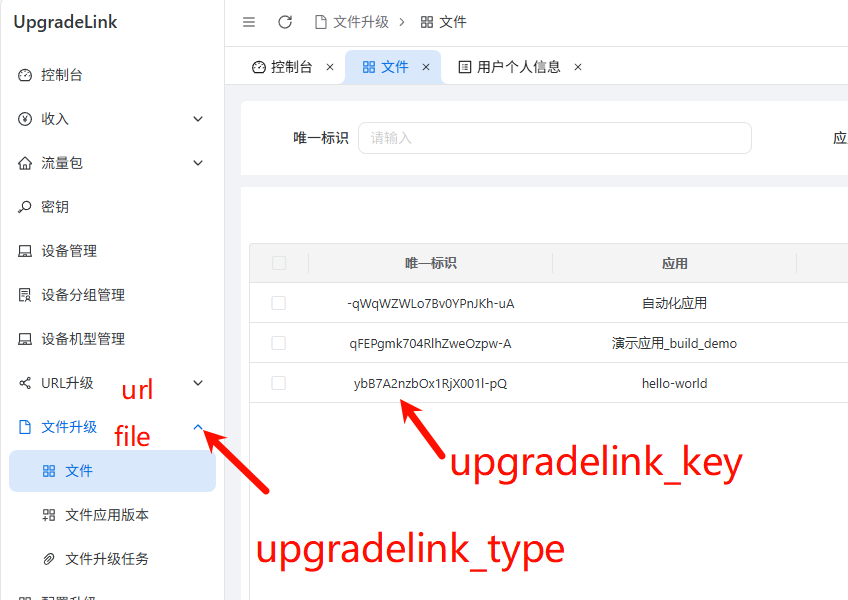

## 功能


此Action用于将指定目录下的文件压缩成zip, 然后上传到[UpgradeLink](http://upgrade.toolsetlink.com/). 可以实现自动升级的功能.

使用视频: 
[todo]()

**注意**
Action运行时需要使用UpgradeLink的账号密码, 介意的请不要使用.

**登陆验证码**
登陆UpgradeLink时需要输入验证码, 可以使用[云码](https://console.jfbym.com/register/TG95218)打码.
## 配置参考
```
{
  "upgradelink_username": "用户名",
  "upgradelink_pwd": "密码",
  "upgradelink_type": "类型. 如file/url/tauri",
  "upgradelink_key": "type对应的唯一key",
  "prompt_upgrade_content": "升级内容",
  "dist_url": ".output",
  "auto_push": true,
  "yunma_token":"云码token"
}

```


**upgradelink_type**:
目前只实现了file类型的

**upgradelink_key**:
每个类型都有一个唯一的key, 用于区分不同的应用. 可以在UpgradeLink的应用管理中查看.

**prompt_upgrade_content**:
升级内容, 会填入到升级任务中的提示升级内容字段.

**dist_url**:
> action的工作目录是项目的根目录.

需要压缩并上传的目录. 比如Nuxt项目的.output目录.

**auto_push**:
是否自动推送升级任务. 默认是true.

## 开发/本地测试
测试相关的逻辑在test目录下.运行前要把**test-config-demo.json**重命名为**test-config.json**并填入你的测试参数.

同时**dist_url参数**对应的目录也要在**根目录**下有一份, 用于测试压缩/上传.

下载项目代码
```bash
git clone https://github.com/wodepig/upgradelink-upload-xxdl.git
```

安装依赖
```bash
cd upgradelink-upload-xxdl
pnpm install
```

填写测试参数
```bash
cd test
cp test-config-demo.json test-config.json
# 填写你的测试参数
```

运行测试逻辑
```bash
pnpm test
```

主要逻辑在**src/index.js**中. 修改后需要打包.
> 有时候代码没生效可能就是没有build
```bash
pnpm build
```

提交代码到git仓库
```bash
#提交代码
```

## 示例
在Nuxt项目中使用此Action. 

```yaml
jobs:
  build-push:
    environment: prod # 指定环境
    runs-on: ubuntu-latest
    steps:
      - name: Checkout code
        uses: actions/checkout@v4
---------------------其他逻辑------------------
      - name: Push To UpgradeLink
        id: push-upgradelink
        uses: wodepig/upgradelink-upload-xxdl@版本号或git提交记录
        with:
          upgradelink_username: ${{ vars.UPGRADELINK_USERNAME }} # vars是Environment variables
          upgradelink_pwd: ${{secrets.UPGRADELINK_PWD}} # secrets是Environment secrets
          upgradelink_type: ${{ vars.UPGRADELINK_TYPE }}
          upgradelink_key: ${{secrets.UPGRADELINK_KEY}}
          prompt_upgrade_content: ${{ env.cleaned_message }} 
          dist_url: .output
          yunma_token: ${{ vars.YUNMA_TOKEN }}
          auto_push: true

```

**prompt_upgrade_content说明**
这里的提交信息是根据git commit消息生成的, 具体用法可查看[build-demo](https://github.com/wodepig/build-demo)
> 因为我设置的是当commit消息包含"自动更新"时才触发升级, 所以这里处理时会去掉"自动更新"这个前缀,然后取剩余的内容. 注意去除后不要是空文本, 会报错
```yml
      - name: Get commit message and clean it
        id: get_commit_message
        run: |
          # 获取最新的 commit 消息
          COMMIT_MESSAGE=$(git log -1 --pretty=%B)
          
          # 清理 commit 消息：去除换行符和特殊字符
          CLEANED_MESSAGE=$(echo "$COMMIT_MESSAGE" | tr -d '\n' | sed 's/自动更新//g')
          
          # 将清理后的 commit 消息设置为环境变量
          echo "cleaned_message=$CLEANED_MESSAGE" >> $GITHUB_ENV
```
